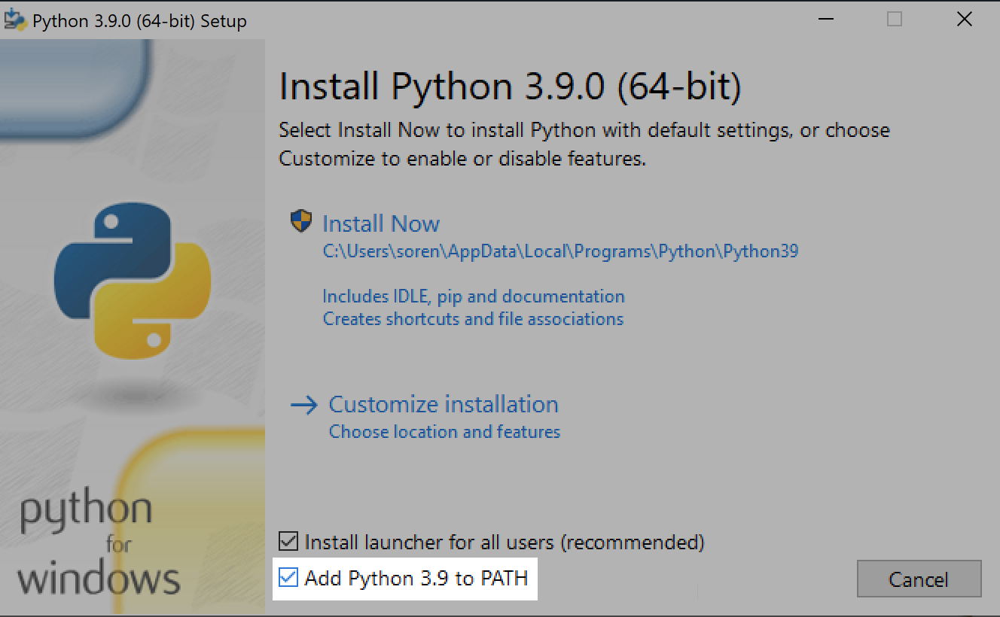
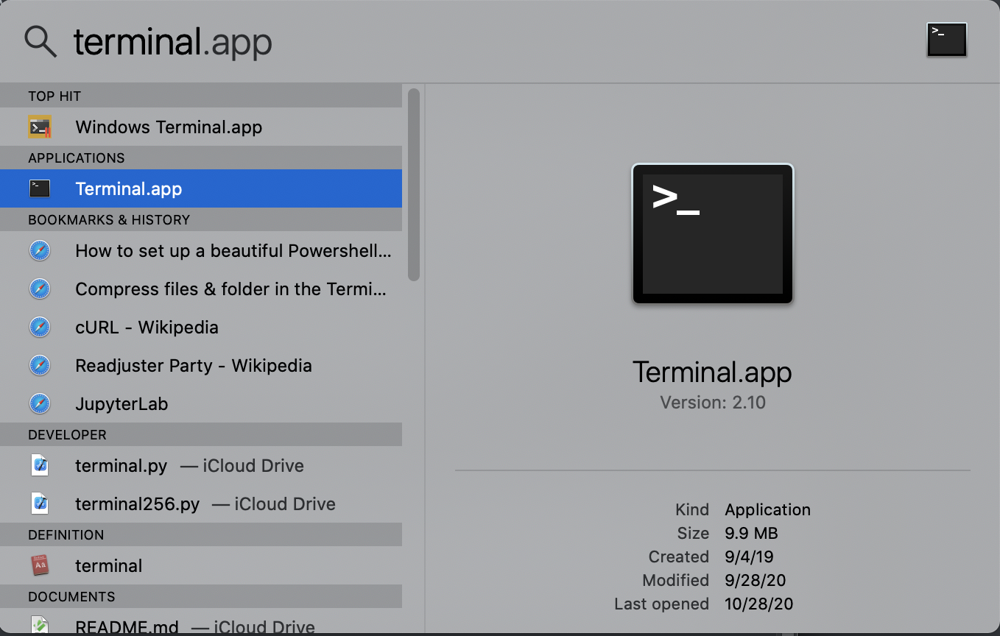

# Make Class Choice File

# Setup

### Installing Python

#### Windows

This program requires Python. If you have not previously installed Python, you will need to do so by following the next section. If you already have Python, you can skip to the [Installing Dependencies](#installing-dependencies) section.

1. You can download Python at its [website](https://www.python.org/downloads/). There will be multiple versions available. It does not matter which one you choose so long as it is version 3.0 or greater. Do not download 2.7.

2. In the installer, ensure that you check "Add Python to PATH".

   

3. You may wish to uncheck "Install launcher for all users" if yours is a shared computer.

4. Restart your computer.

5. When your computer is rebooted, open the command prompt by clicking the Start button and typing "cmd". It should appear in the search results.

6. In the command prompt, type:

   `python -V`

   Press _Enter_.

   Note: you can paste text into the command prompt by right clicking anywhere in the black space. It is a good idea to copy and paste all the commands in this document so as to avoid typos.

   The version number of your Python installation should print. For example, for the most recent version of Python as of the time of this writing, you would see: `Python 3.9.0`.

   If anything else happens, something went wrong. Concact Brandon or Terri.

#### macOS

Python comes pre-installed on macOS. It is accessed through the Terminal.app application, which is located in the "Utilities" sub-folder in the "Applications" folder. You can find it quickly by pressing Command ⌘ and the space bar at the same time to bring up Spotlight. Here type "terminal", and you will see it among the results.

Type `python -V` to print the version number.

### PowerSchool Credentials

This program interfaces with PowerSchool, and to do that we need to have specific ID and passcode. You will recieve a JSON file called `powerschool-credentials.json` that contains the credentials. The program cannot run without this file.

### Installing Dependencies

On top of Python we need a few extra tools, which we can use Python to install. Copy the following command and paste into the console:

`python -m pip install --user pandas xlrd requests`

This command uses Python to install three tools:

- `pandas` is a package for working with tablular data like that found in CSV and Excel files
- `xlrd` is a package for reading in Excel files
- `requests` is used to get the section data from PowerSchool

#### Notice: No pip

On older versions of macOS, you may get an error stating that `pip` could not be found. `pip` is a program that manages any extra tools that you install for Python. If it is not installed, copy and paste the following command to do so:

`curl https://bootstrap.pypa.io/get-pip.py -o get-pip.py && python get-pip.py`

This operation downloads a small file called `get-pip.py`. You can delete it now.

With pip installed, rerun the above Python command either by copy and pasting it again or pressing up twice on the keyborard with Terminal in focus.

## Running the Script

At this point, running the script will be rather straightforward. There are a few steps that differ depending on your platform:

- On Windows, you must double click the `make_classchoice.py` file. If you do not see a file with the `.py` extension, look at the "Type" column in the file explorer. You want the one that says "Python file".
- On macOS, you want to click the `make_classchoice` file with no extension. This will open a Terminal window.
- Type the term ID for for the sections you want to create new sections for.

