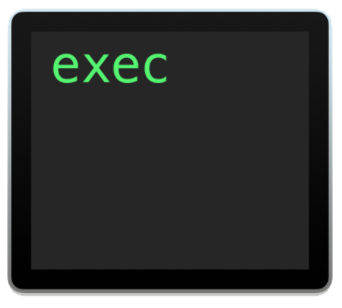

# Make Class Choice File

### PowerSchool Credentials

This program interfaces with PowerSchool, and to do that we need to have specific ID and passcode. You will recieve a JSON file called `powerschool-credentials.json` that contains the credentials. The program cannot run without this file. 

## Running the Script

Running the script is rather straightforward. There are a few steps that differ depending on your platform:

- Windows

  - You must double click the `make_classchoice.py` file. If you do not see a file with the `.py` extension, look at the "Type" column in the file explorer. You want the one that says "Python file".

- macOS

  - You want to click the `make_classchoice` file with no extension. Its icon should look like this:
    

     This will open a Terminal window.

- Type the term ID or IDs of the sections for which you want to create new sections. If there are multiple IDs, they must be provided in a comma-separated list. See the example below:

  ```
  For which term ID should classes be created? (Press ENTER or CTL+C to cancel.)
  >>> 3000,3002,3003
  ```

  


