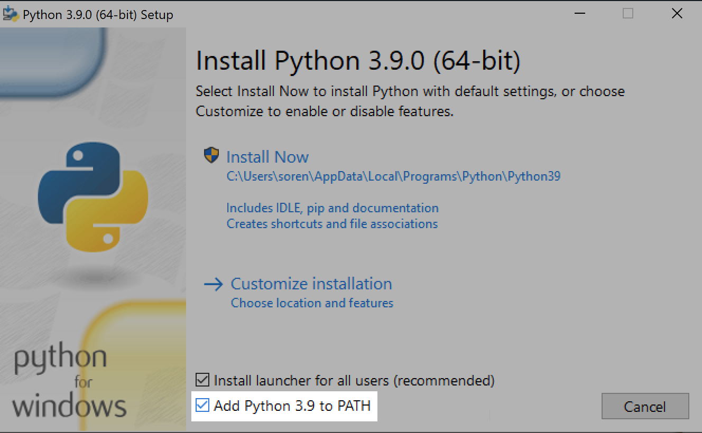
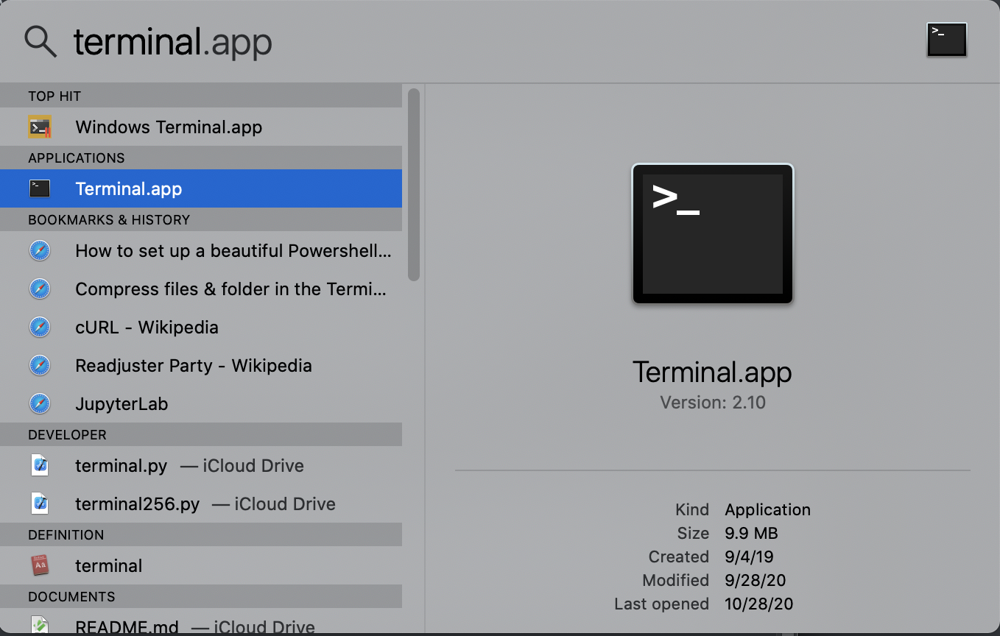

# Installing Python

The following section covers the installation of the Python language interpreter, which is necessary for running Python scripts. Python is one of the most widely used programming languages in the world and even comes pre-installed on some operating systems, such as macOS and most Linux distrobutions. So long as you follow the instructions closely, there is no risk of installing anything malicious on your machine.

If you already have Python, you can skip to the [Installing Dependencies](#installing-dependencies) section.

#### Windows

Python does not come preinstalled on Windows. Use the following instructions to install it:

1. You can download Python at its [website](https://www.python.org/downloads/). There will be multiple versions available. It does not matter which one you choose so long as it is version 3.0 or greater. Do not download 2.7.

2. In the installer, ensure that you check "Add Python to PATH".

   

3. You may wish to uncheck "Install launcher for all users" if yours is a shared computer.

4. Restart your computer.

5. When your computer is rebooted, open the command prompt by clicking the Start button and typing "cmd". It should appear in the search results.

6. In the command prompt, type:

   `python -V`

   Press _Enter_.

   Note: you can paste text into the command prompt by right clicking anywhere in the black space. It is a good idea to copy and paste all the commands in this document so as to avoid typos.

   The version number of your Python installation should print. For example, for the most recent version of Python as of the time of this writing, you would see: `Python 3.9.0`.

   If anything else happens, something went wrong. Concact Brandon or Terri.

#### macOS

Python comes pre-installed on macOS. It is accessed through the Terminal.app application, which is located in the "Utilities" sub-folder in the "Applications" folder. You can find it quickly by pressing Command ⌘ and the space bar at the same time to bring up Spotlight. Here type "terminal", and you will see it among the results.

Type `python -V` to print the version number.

## Installing Dependencies

On top of Python we need a few extra tools, which we can use Python to install. Copy the following command and paste into the console (recall that you can right click anywhere inside the window to paste on Windows):

`python -m pip install --user pandas xlrd requests`

This command uses Python to install three tools:

- `pandas` is a package for working with tablular data like that found in CSV and Excel files
- `xlrd` is a package for reading in Excel files
- `requests` is used to communicate with get the section data from PowerSchool